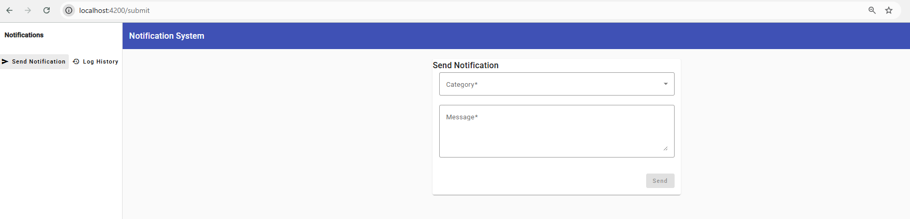
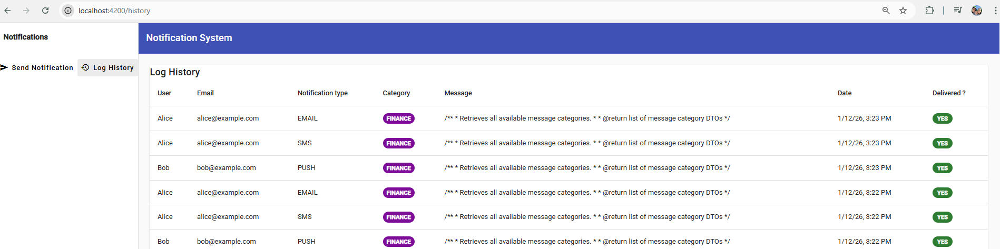

# Notification Frontend Application

Angular-based frontend application for managing the delivery of notifications.  
This application connects to a Spring Boot backend API, allowing users to send notifications by category and message, and to visualize the history of sent notifications.

---

## 🎯 Purpose

The goal of this frontend application is to provide a simple and clean user interface to interact with the notification management backend.  
It focuses on usability, validation, and clear visualization of notification records.

---

## ✨ Features

- Send notifications by selecting a category and entering a message
- Form validation using Reactive Forms
- Visual feedback on successful or failed submissions
- View notification history ordered from newest to oldest
- Responsive UI built with Angular Material
- Clear separation of components and services

---

## 🖥️ Application Screens

### 📤 Notification Submission

Users can select a category, write a message, and send a notification to all subscribed users.

---

### 📜 Notification History

Displays a list of all sent notifications, including category, message, delivery status, and timestamp.

---

## 🛠️ Technology Stack

### Core Technologies

- **Angular 19**
- **TypeScript 5.7**
- **RxJS 7**
- **Angular Material 19**
- **Angular CDK**

### UI & Forms

- Angular Material components
- Reactive Forms for validation
- Material Table for data visualization

---

## 🔌 Backend Integration

This application communicates with a Spring Boot backend via REST APIs.

### Main Endpoints Used

- `GET /api/v1/catalogs/categories` – Retrieve available categories
- `POST /api/v1/notifications/send` – Send a new notification
- `GET /api/v1/notifications` – Retrieve notification history

---